# Test Graphs

Auto-generated from `src/Test/testGraphs.ts` by `src/Test/generateGraphVisual.ts`
Required Mermaid support in Markdown to render. For VS Code, use the 'shd101wyy.markdown-preview-enhanced' extension

## Key

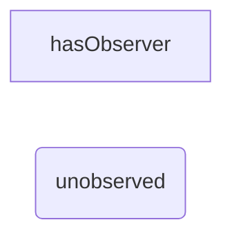

## SmallSelfCycle
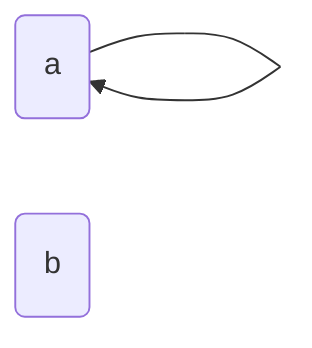

## SmallAcyclic
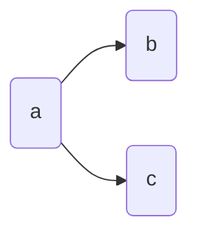

## SmallChain
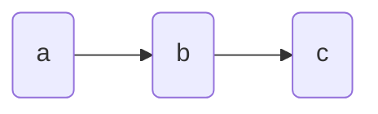

## SmallChevron
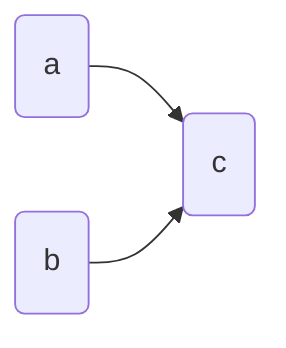

## MediumAcylic
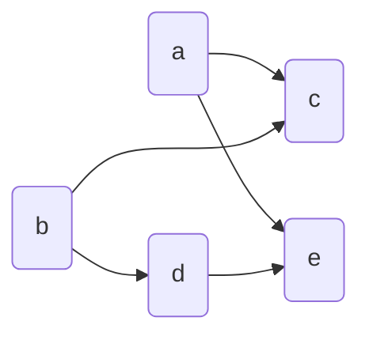

## Medium3NodeCycle
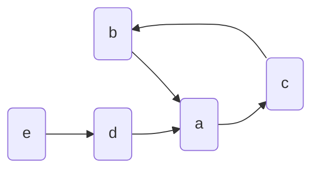

## MediumFigureEightCycle
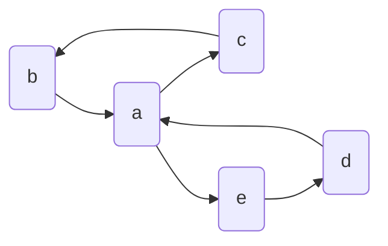

## MediumDAG
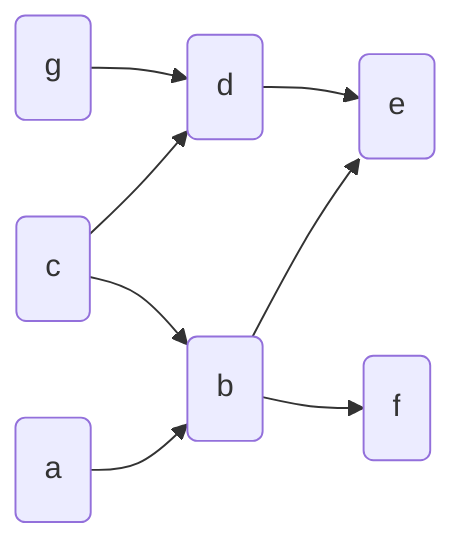

## 3By3NuralNet
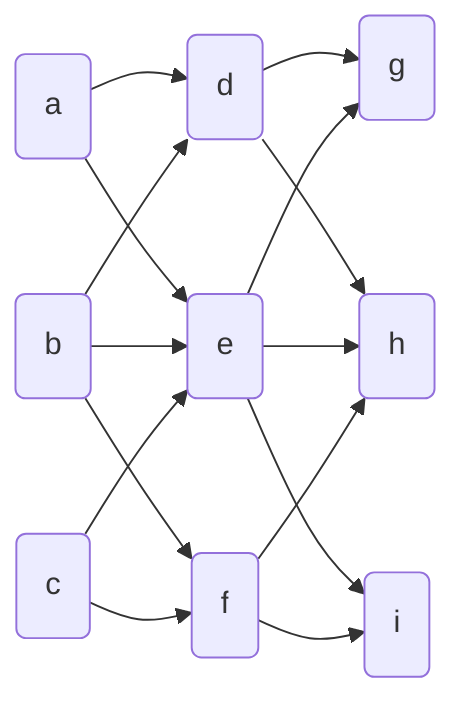

## 7NodeBinaryTree
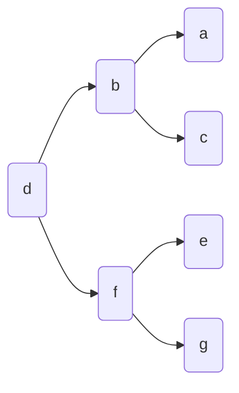
  